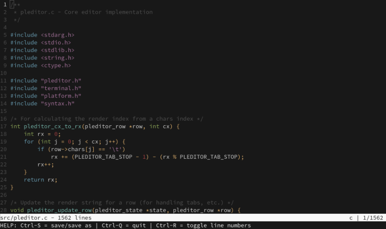

# pleditor

pleditor is a simple text editor that works with terminal devices supporting VT100 escape sequences. The core editor functionality is platform-independent, while platform-specific functionality is abstracted through a clean interface.

## Screenshot



## Features

- Platform independent core
- VT100 terminal interface with status bar
- Colorful syntax highlighting
- Various operations (insert, delete, undo, redo, search, etc.)
- Reference Linux implementation included

## Keyboard Shortcuts

- `Ctrl-S`: Save file
- `Ctrl-Q`: Quit
- `Ctrl-Z`: Undo
- `Ctrl-Y`: Redo
- `Ctrl-F`: Search
    - `Ctrl-N`: Next match
    - `Ctrl-P`: Previous match
- `Ctrl-R`: Toggle line numbers
- Arrow keys: Move cursor
- Page Up/Down: Scroll by page
- Home/End: Move to start/end of line

## Building

The project uses xmake as its build system. To build:

```
xmake
```

To build and run:

```
xmake run pleditor <filename>
```

## Architecture

The editor is split into platform-independent and platform-dependent code.

- `pleditor.*`: Core editor functionality
- `syntax.*`: Syntax highlighting
- `terminal.h`: VT100 terminal control codes

**Platform specific code:**

- `platform.h`: Platform abstraction interface
- `platform/linux.c`: Linux implementation of the platform interface

## Porting to Other Platforms

To port the editor to another platform:

1. Create a new file in the `src/platform` directory (e.g., `src/platform/your_platform.c`)
2. Implement all functions declared in `platform.h`
3. Update the build system to use your platform file

## License

See LICENSE file for details.
